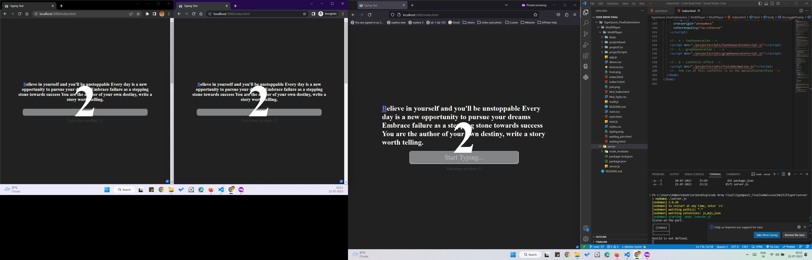

# TypeQuest_FinalSubmission

### Developers Group in Code Brew 2023

## Team Members

- Aarsh Patel
- Sagnik Choudhury
- Arka Lodh

## Project Screenshots

## References

https://socket.io/

https://codedamn.com/news/javascript/fix-require-is-not-defined

https://www.npmjs.com/package/socket.io

https://www.youtube.com/watch?v=Esp_eIKh0M4&list=PLQDioScEMUhnRngUlo15YDXvAaaH8LUq7&index=2

https://www.npmjs.com/package/cors

https://mongoosejs.com/docs/schematypes.html#numbers

https://stackoverflow.com/questions/15040297/clear-element-classlist

https://www.w3schools.com/jsref/met_win_setinterval.asp

https://dev.to/lico/

https://www.npmjs.com/package/cors

https://www.tutorialrepublic.com/faq/

https://gamedev.stackexchange.com/questions/18342/how-to-handle-multiplayer-in-javascript

https://dev.to/valyouw/a-simple-multi-player-online-game-using-node-js-part-i-3gnp

https://itnext.io/

https://speed-typing-game-12.netlify.app/
